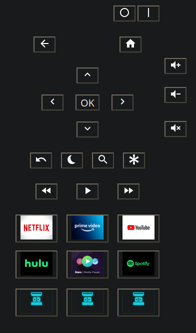

# RokuWebRemote
Web-based remote for controlling Roku Devices.

## Requirements
* Roku device on local network
* HomeAssistant instance (for WoL via REST)

## Description
This is a webpage you can host locally on your own network to allow controlling a Roku Device with a custom interface.  
For waking powered-off devices, this uses the HomeAssistant Wake-on-LAN REST endpoint, though you could optionally add your own integration for other Wake-on-LAN implementations.  
  
## Motivation
I was unsatisfied with the Roku Remote app for Android for the following reasons:
* Ads in the app (who wants that on the _remote_?)
* Closed-source nature
* Inconsistent ability to find my TV on the network
* Overall sluggishness
* Probably lots of unnecessary phoning-home, knowing Roku
  
I was unsatisfied with the existing HomeAssistant Roku remote integrations for the following reasons:
* Incomplete implementation (can't consistently turn devices on and off)
* Missing several buttons (e.g arrow keys, channel buttons)
  
Despite the fact that it's clearly a method for Roku to charge additional fees for priority due to scarcity, I actually like the physical remote's buttons for individual channels - e.g. my remote has a button for Hulu, Netflix, etc. However, it also has a button for Sling and Roku Movies which I have absolutely no interest in using, and is missing buttons for Roku Media Player, Amazon Prime Video, and Disney+.  
I decided to make this project resemble the button layouts on the physical remote that came with my TV with a few extra buttons not present there.

## Screenshot

  
## Notes
Waking completely powered-off devices is done using HomeAssistant, and requires a valid API key from your local instance.  
  
This is intended for easy integration into a HomeAssistant using the Webpage widget in LoveLace UI.  
For best results, host the content behind a reverse SSL proxy such as Nginx - though all communication with the Roku device is done in clear HTTP per the official Roku API.
  
Please do not expect any support for this.
